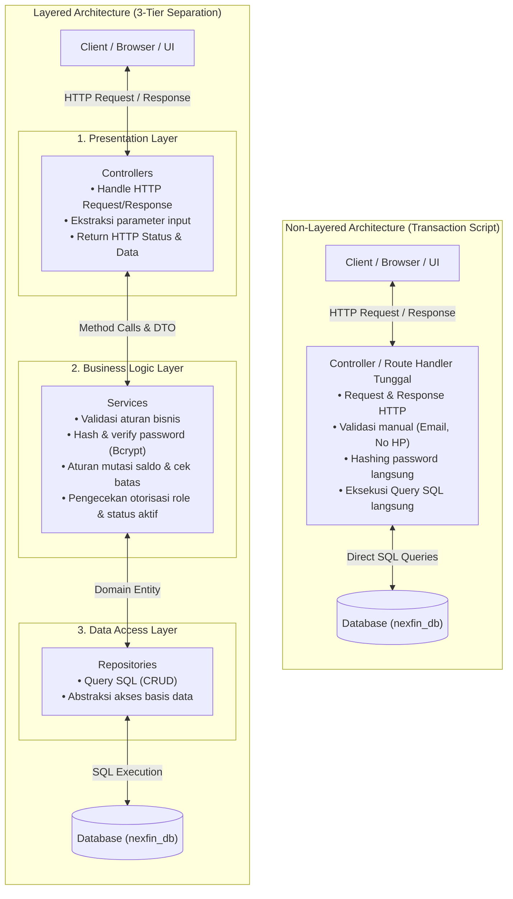

```mermaid
flowchart TB
    subgraph NonLayeredArch["Non-Layered Architecture (Transaction Script)"]
        direction TB
        ClientNL["Client / Browser / UI"]
        HandlerNL["Controller / Route Handler Tunggal\n• Request & Response HTTP\n• Validasi manual (Email, No HP)\n• Hashing password langsung\n• Eksekusi Query SQL langsung"]
        DatabaseNL[("Database (nexfin_db)")]

        ClientNL <-->|"HTTP Request / Response"| HandlerNL
        HandlerNL <-->|"Direct SQL Queries"| DatabaseNL
    end

    subgraph LayeredArch["Layered Architecture (3-Tier Separation)"]
        direction TB
        ClientL["Client / Browser / UI"]
        
        subgraph Presentation["1. Presentation Layer"]
            PresLayer["Controllers\n• Handle HTTP Request/Response\n• Ekstraksi parameter input\n• Return HTTP Status & Data"]
        end

        subgraph Business["2. Business Logic Layer"]
            BizLayer["Services\n• Validasi aturan bisnis\n• Hash & verify password (Bcrypt)\n• Aturan mutasi saldo & cek batas\n• Pengecekan otorisasi role & status aktif"]
        end

        subgraph DataAccess["3. Data Access Layer"]
            DataLayer["Repositories\n• Query SQL (CRUD)\n• Abstraksi akses basis data"]
        end

        DatabaseL[("Database (nexfin_db)")]

        ClientL <-->|"HTTP Request / Response"| PresLayer
        PresLayer <-->|"Method Calls & DTO"| BizLayer
        BizLayer <-->|"Domain Entity"| DataLayer
        DataLayer <-->|"SQL Execution"| DatabaseL
    end
```

