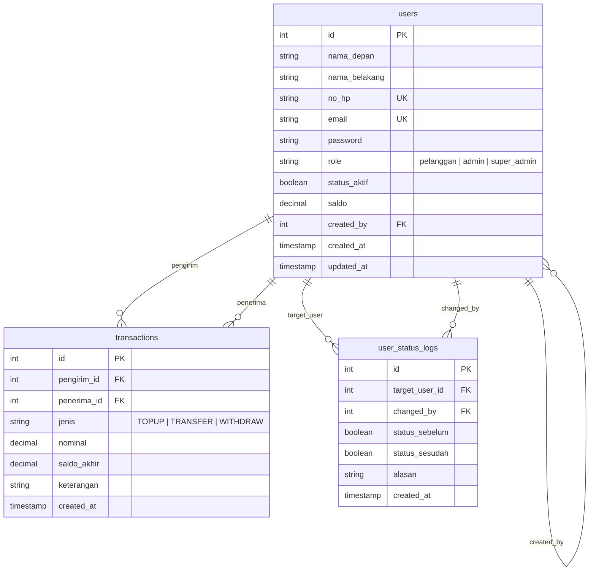

```mermaid
erDiagram
    users ||--o{ transactions : "pengirim"
    users ||--o{ transactions : "penerima"
    users ||--o{ user_status_logs : "target_user"
    users ||--o{ user_status_logs : "changed_by"
    users ||--o{ users : "created_by"

    users {
        int id PK
        string nama_depan
        string nama_belakang
        string no_hp UK
        string email UK
        string password
        string role "pelanggan | admin | super_admin"
        boolean status_aktif
        decimal saldo
        int created_by FK
        timestamp created_at
        timestamp updated_at
    }

    transactions {
        int id PK
        int pengirim_id FK
        int penerima_id FK
        string jenis "TOPUP | TRANSFER | WITHDRAW"
        decimal nominal
        decimal saldo_akhir
        string keterangan
        timestamp created_at
    }

    user_status_logs {
        int id PK
        int target_user_id FK
        int changed_by FK
        boolean status_sebelum
        boolean status_sesudah
        string alasan
        timestamp created_at
    }
```

