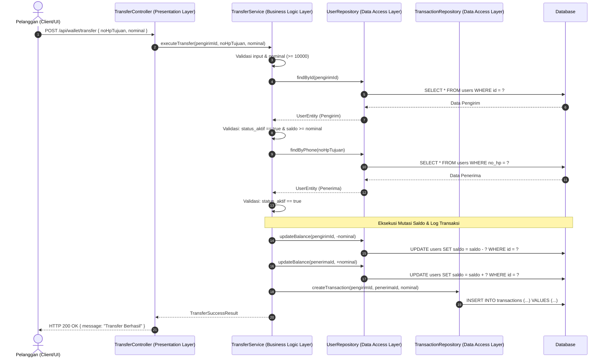

```mermaid
sequenceDiagram
    autonumber
    actor Pelanggan as Pelanggan (Client/UI)
    participant Controller as TransferController (Presentation Layer)
    participant Service as TransferService (Business Logic Layer)
    participant UserRepo as UserRepository (Data Access Layer)
    participant TxRepo as TransactionRepository (Data Access Layer)
    participant DB as Database

    Pelanggan->>Controller: POST /api/wallet/transfer { noHpTujuan, nominal }
    Controller->>Service: executeTransfer(pengirimId, noHpTujuan, nominal)
    
    Service->>Service: Validasi input & nominal (>= 10000)
    Service->>UserRepo: findById(pengirimId)
    UserRepo->>DB: SELECT * FROM users WHERE id = ?
    DB-->>UserRepo: Data Pengirim
    UserRepo-->>Service: UserEntity (Pengirim)
    Service->>Service: Validasi: status_aktif == true & saldo >= nominal

    Service->>UserRepo: findByPhone(noHpTujuan)
    UserRepo->>DB: SELECT * FROM users WHERE no_hp = ?
    DB-->>UserRepo: Data Penerima
    UserRepo-->>Service: UserEntity (Penerima)
    Service->>Service: Validasi: status_aktif == true

    Note over Service,DB: Eksekusi Mutasi Saldo & Log Transaksi
    Service->>UserRepo: updateBalance(pengirimId, -nominal)
    UserRepo->>DB: UPDATE users SET saldo = saldo - ? WHERE id = ?
    Service->>UserRepo: updateBalance(penerimaId, +nominal)
    UserRepo->>DB: UPDATE users SET saldo = saldo + ? WHERE id = ?
    Service->>TxRepo: createTransaction(pengirimId, penerimaId, nominal)
    TxRepo->>DB: INSERT INTO transactions (...) VALUES (...)

    Service-->>Controller: TransferSuccessResult
    Controller-->>Pelanggan: HTTP 200 OK { message: "Transfer Berhasil" }
```

