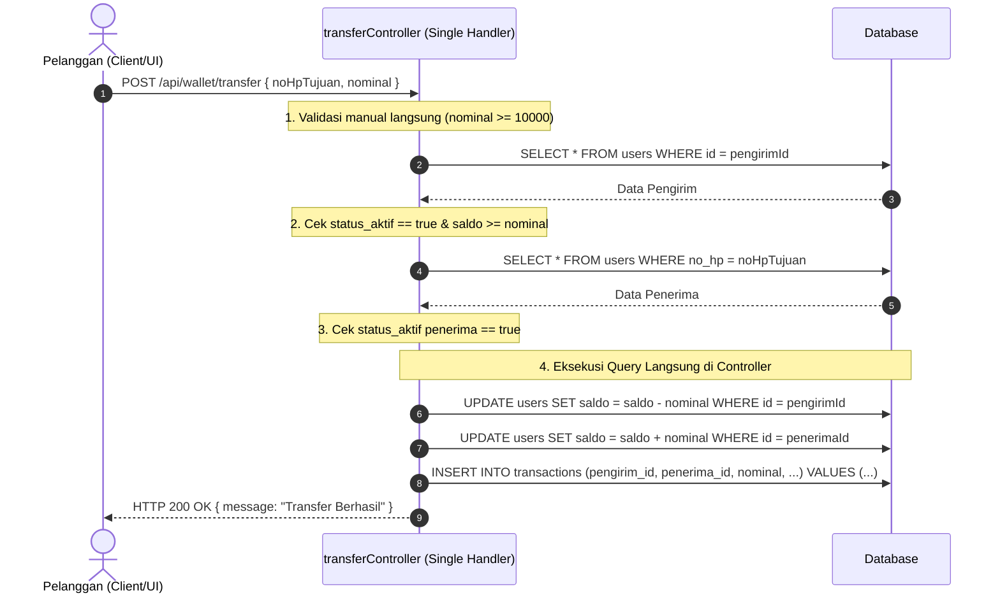

```mermaid
sequenceDiagram
    autonumber
    actor Pelanggan as Pelanggan (Client/UI)
    participant Handler as transferController (Single Handler)
    participant DB as Database

    Pelanggan->>Handler: POST /api/wallet/transfer { noHpTujuan, nominal }
    
    Note over Handler: 1. Validasi manual langsung (nominal >= 10000)
    
    Handler->>DB: SELECT * FROM users WHERE id = pengirimId
    DB-->>Handler: Data Pengirim
    Note over Handler: 2. Cek status_aktif == true & saldo >= nominal
    
    Handler->>DB: SELECT * FROM users WHERE no_hp = noHpTujuan
    DB-->>Handler: Data Penerima
    Note over Handler: 3. Cek status_aktif penerima == true
    
    Note over Handler,DB: 4. Eksekusi Query Langsung di Controller
    Handler->>DB: UPDATE users SET saldo = saldo - nominal WHERE id = pengirimId
    Handler->>DB: UPDATE users SET saldo = saldo + nominal WHERE id = penerimaId
    Handler->>DB: INSERT INTO transactions (pengirim_id, penerima_id, nominal, ...) VALUES (...)
    
    Handler-->>Pelanggan: HTTP 200 OK { message: "Transfer Berhasil" }
```

