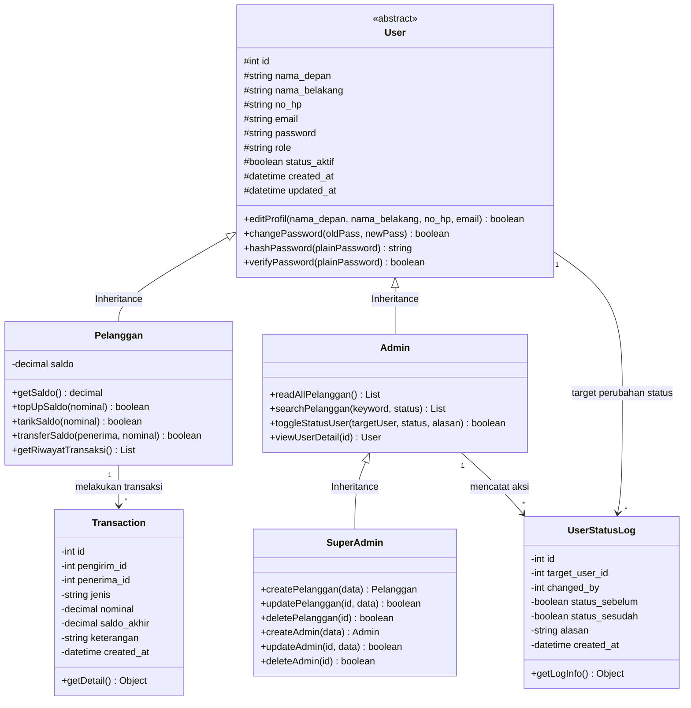

```mermaid
classDiagram
    direction TB

    class User {
        <<abstract>>
        #int id
        #string nama_depan
        #string nama_belakang
        #string no_hp
        #string email
        #string password
        #string role
        #boolean status_aktif
        #datetime created_at
        #datetime updated_at
        +editProfil(nama_depan, nama_belakang, no_hp, email) boolean
        +changePassword(oldPass, newPass) boolean
        +hashPassword(plainPassword) string
        +verifyPassword(plainPassword) boolean
    }

    class Pelanggan {
        -decimal saldo
        +getSaldo() decimal
        +topUpSaldo(nominal) boolean
        +tarikSaldo(nominal) boolean
        +transferSaldo(penerima, nominal) boolean
        +getRiwayatTransaksi() List
    }

    class Admin {
        +readAllPelanggan() List
        +searchPelanggan(keyword, status) List
        +toggleStatusUser(targetUser, status, alasan) boolean
        +viewUserDetail(id) User
    }

    class SuperAdmin {
        +createPelanggan(data) Pelanggan
        +updatePelanggan(id, data) boolean
        +deletePelanggan(id) boolean
        +createAdmin(data) Admin
        +updateAdmin(id, data) boolean
        +deleteAdmin(id) boolean
    }

    class Transaction {
        -int id
        -int pengirim_id
        -int penerima_id
        -string jenis
        -decimal nominal
        -decimal saldo_akhir
        -string keterangan
        -datetime created_at
        +getDetail() Object
    }

    class UserStatusLog {
        -int id
        -int target_user_id
        -int changed_by
        -boolean status_sebelum
        -boolean status_sesudah
        -string alasan
        -datetime created_at
        +getLogInfo() Object
    }

    User <|-- Pelanggan : Inheritance
    User <|-- Admin : Inheritance
    Admin <|-- SuperAdmin : Inheritance
    Pelanggan "1" --> "*" Transaction : melakukan transaksi
    User "1" --> "*" UserStatusLog : target perubahan status
    Admin "1" --> "*" UserStatusLog : mencatat aksi
```

