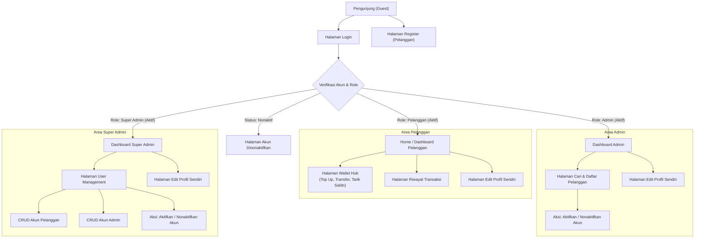

```mermaid
flowchart TD
    Guest["Pengunjung (Guest)"] --> LoginPage["Halaman Login"]
    Guest --> RegisterPage["Halaman Register (Pelanggan)"]

    LoginPage --> AuthCheck{"Verifikasi Akun & Role"}
    
    AuthCheck -->|"Status: Nonaktif"| BlockedPage["Halaman Akun Dinonaktifkan"]
    AuthCheck -->|"Role: Pelanggan (Aktif)"| HomePelanggan["Home / Dashboard Pelanggan"]
    AuthCheck -->|"Role: Admin (Aktif)"| DashboardAdmin["Dashboard Admin"]
    AuthCheck -->|"Role: Super Admin (Aktif)"| DashboardSuper["Dashboard Super Admin"]

    subgraph AreaPelanggan["Area Pelanggan"]
        HomePelanggan --> WalletPage["Halaman Wallet Hub\n(Top Up, Transfer, Tarik Saldo)"]
        HomePelanggan --> TxHistoryPage["Halaman Riwayat Transaksi"]
        HomePelanggan --> ProfilePageP["Halaman Edit Profil Sendiri"]
    end

    subgraph AreaAdmin["Area Admin"]
        DashboardAdmin --> SearchPage["Halaman Cari & Daftar Pelanggan"]
        SearchPage --> ToggleStatusA["Aksi: Aktifkan / Nonaktifkan Akun"]
        DashboardAdmin --> ProfilePageA["Halaman Edit Profil Sendiri"]
    end

    subgraph AreaSuperAdmin["Area Super Admin"]
        DashboardSuper --> UserMgmtPage["Halaman User Management"]
        UserMgmtPage --> CRUDCust["CRUD Akun Pelanggan"]
        UserMgmtPage --> CRUDAdm["CRUD Akun Admin"]
        UserMgmtPage --> ToggleStatusSA["Aksi: Aktifkan / Nonaktifkan Akun"]
        DashboardSuper --> ProfilePageSA["Halaman Edit Profil Sendiri"]
    end
```

